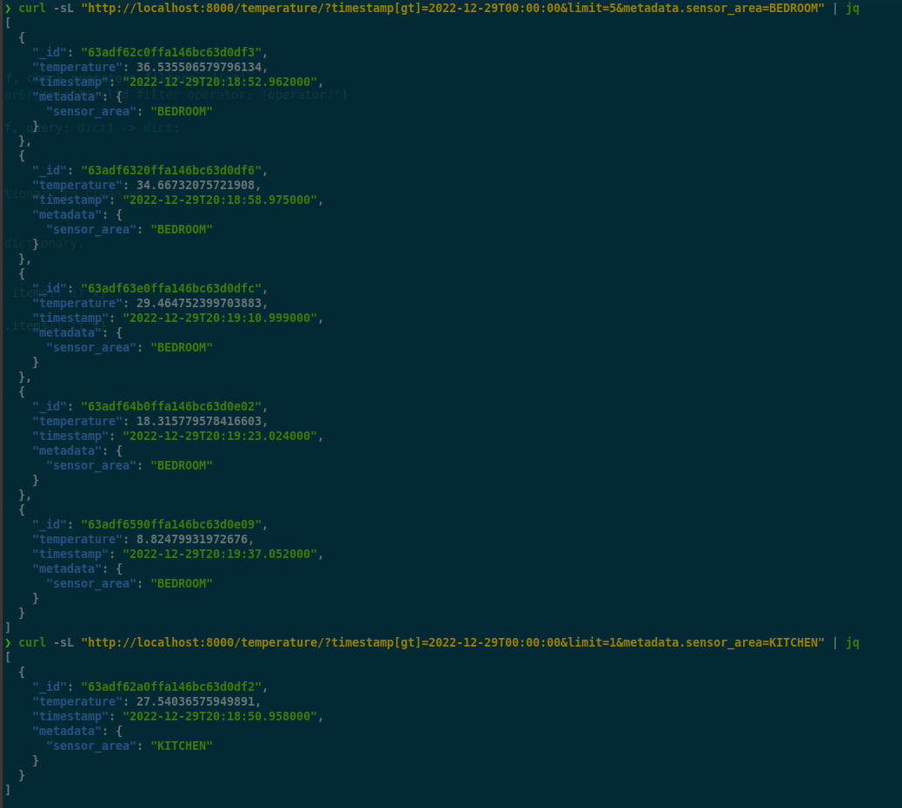

# Timeseries

Python exercise

&nbsp;&nbsp;&nbsp;&nbsp;

## Requirements

- [Pyenv](https://github.com/pyenv/pyenv)
- [Pyenv virtualenv](https://github.com/pyenv/pyenv-virtualenv)
- `GNU make`

## Query String Filters

API endpoint with query string filters deep-object like:

## TODO

check usage of [mongo engine ORM](http://mongoengine.org/) with timeseries collection

## License

