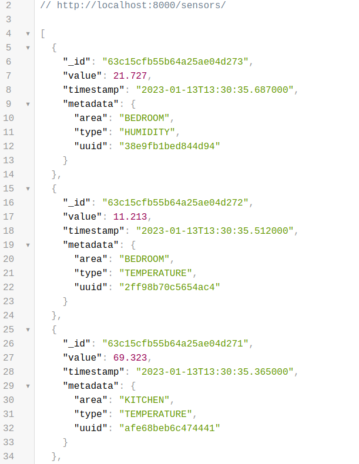
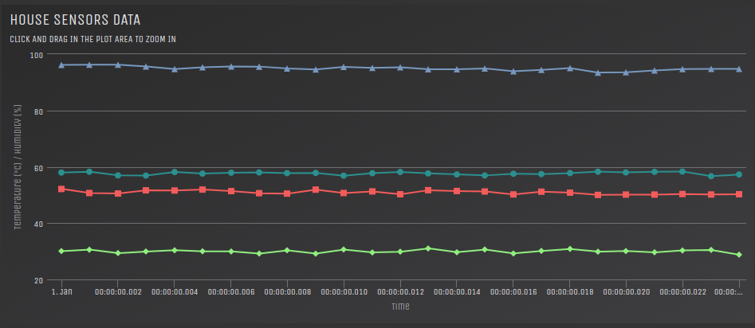
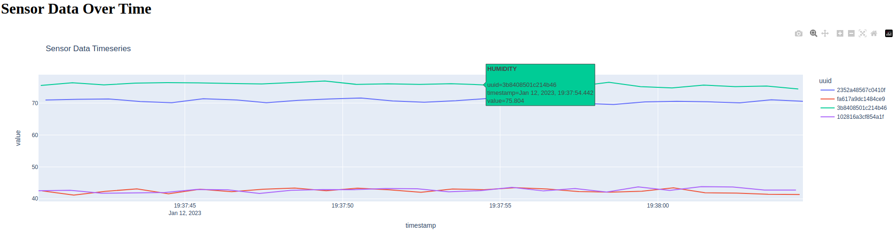
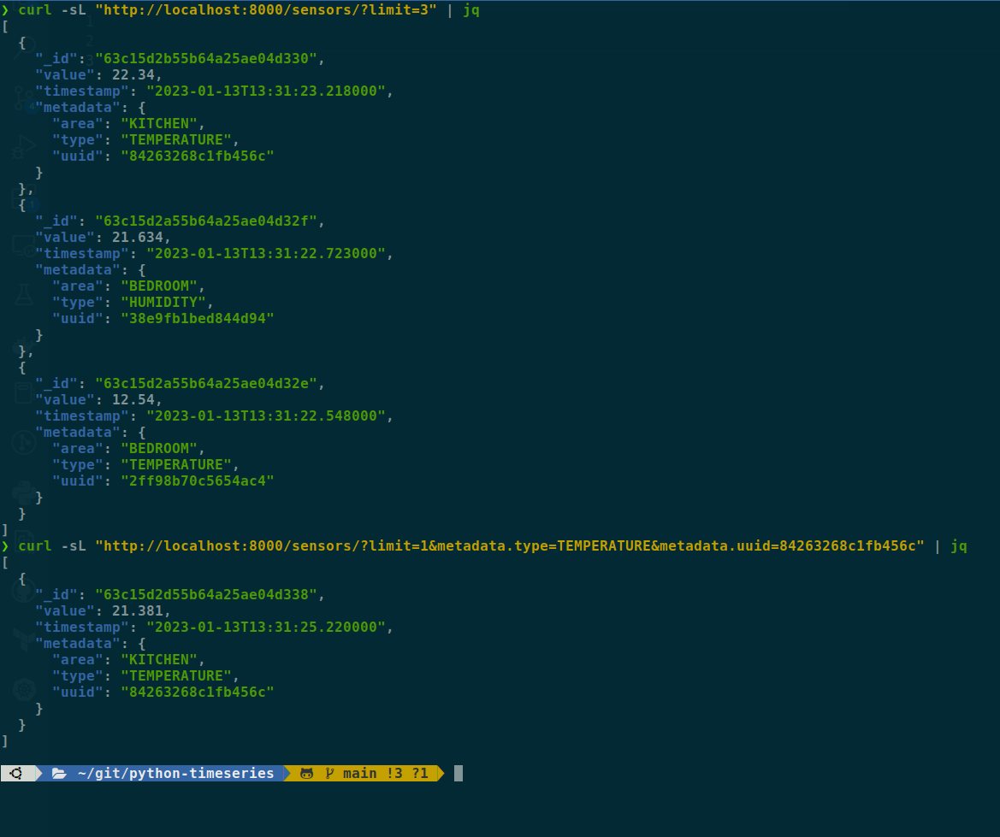

# Timeseries

This is an coding practice repository for a timeseries API using python, angular, mqtt and MongoDB.


&nbsp;&nbsp;[](https://github.com/rcbop/python-timeseries/actions/workflows/lint-k8s-manifests.yaml)&nbsp;&nbsp;[](https://codecov.io/gh/rcbop/timeseries-visualization)&nbsp;&nbsp;[](https://github.com/rcbop/python-timeseries/actions/workflows/github-code-scanning/codeql)&nbsp;&nbsp;[](https://app.fossa.com/projects/git%2Bgithub.com%2Frcbop%2Fpython-timeseries?ref=badge_shield)

## Requirements

- [Pyenv](https://github.com/pyenv/pyenv)
- [Pyenv virtualenv](https://github.com/pyenv/pyenv-virtualenv)
- `GNU make`

## Development

Run all tests with docker compose:

```
make test
```

Spin up development environment:

```
make compose-up
```

## Query String Filters

API endpoint with query string filters deep-object like:

```
?timestamp[gte]=2021-01-01T00:00:00&timestamp[lte]=2021-01-05T00:00:00&metadata.area=kitchen&limit=100"
```

will become mongo query:

```
{
    "timestamp": { $gte: ISODate("2021-01-01T00:00:00"), $lte: ISODate("2021-01-05T00:00:00") },
    "metadata": { "area": "kitchen" },
    "limit": 100
}
```

## Preview

### Default endpoint result:

Limits to 100 results:



### Angular Custom Dashboard:



### Plotly Dashboard:



### Filtering by query string example:



## Dependencies
[](https://app.fossa.com/projects/git%2Bgithub.com%2Frcbop%2Fpython-timeseries?ref=badge_small)

## TODO

- ~~API pagination offset~~ (done)
- ~~Pyparsing query validation~~ (done)
- check usage of [mongo engine ORM](http://mongoengine.org/) with timeseries collection
- [kube-linter](https://docs.kubelinter.io/#/) [does not support kustomize](https://github.com/stackrox/kube-linter/issues/113), pre-render manifests before running linter
- add UI tests (cypress)
- ~~increase test coverage~~ (done)
- instrumentation, tracing, metrics and monitoring
- terraform deployment
