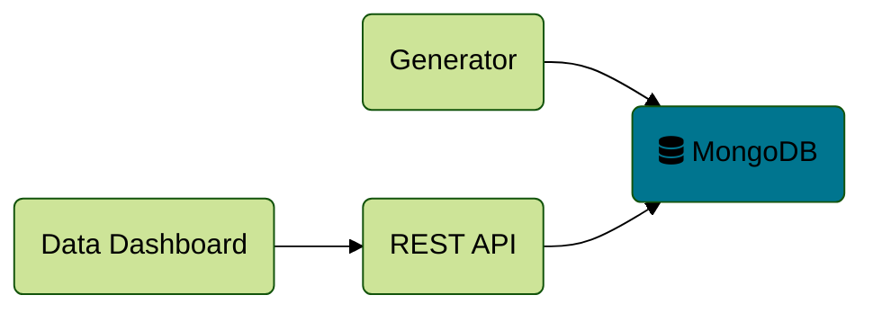

## Components Overview

Testing mermaid :)

```mermaid
%%{init: {'theme':'forest'}}%%
graph LR
  data-generator(<font color=black>Generator)
  mongodb(<font color=black>fa:fa-database MongoDB)
  data-api(<font color=black> REST API)
  data-dashboard(<font color=black> Data Dashboard)

  data-generator-->mongodb
  data-api-->mongodb
  data-dashboard-->data-api
  style mongodb fill:#00758f
```
